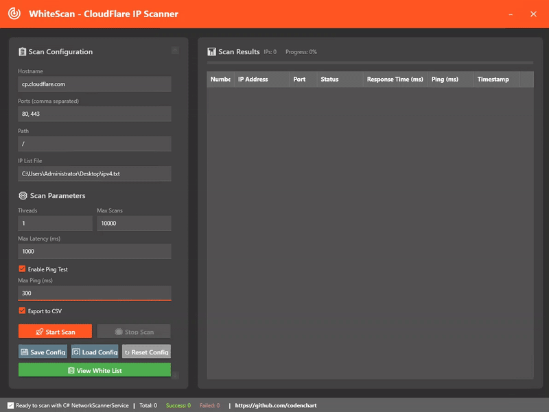

# WhiteScan - CloudFlare IP Scanner

<div align="center">



**A professional WPF application for scanning and analyzing CloudFlare IP addresses with advanced network diagnostics**

[](https://dotnet.microsoft.com/download/dotnet/9.0)
[](https://docs.microsoft.com/en-us/dotnet/desktop/wpf/)
[](https://materialdesigninxaml.net/)
[](LICENSE)

</div>

## 📋 Table of Contents

- [Overview](#overview)
- [Features](#features)
- [Installation](#installation)
- [Usage](#usage)
- [Configuration](#configuration)
- [Architecture](#architecture)
- [Dependencies](#dependencies)
- [Contributing](#contributing)
- [License](#license)

## 🎯 Overview

WhiteScan is a Desktop application built with WPF and .NET 9.0, designed specifically for scanning and analyzing CloudFlare IP addresses. The application provides real-time network diagnostics, latency measurements, and comprehensive reporting capabilities for network administrators and security professionals.

### Key Capabilities

- **Multi-threaded IP scanning** with configurable concurrency
- **Real-time latency and ping measurements**
- **Jitter analysis** for network quality assessment
- **Download speed testing** for performance evaluation
- **CSV export** for detailed reporting
- **Modern Material Design UI** with dark theme
- **Configurable scan parameters** for flexible testing scenarios

## ✨ Features

### 🔍 Advanced Scanning
- **Concurrent scanning** with up to 8 goroutines (configurable)
- **Port range scanning** (HTTP/HTTPS support)
- **Ping testing** with configurable timeout thresholds
- **Latency measurement** with millisecond precision

### 📊 Real-time Monitoring
- **Live progress tracking** with percentage completion
- **Real-time results display** in organized data grid
- **Success/failure statistics** with detailed error reporting
- **Current target highlighting** during active scans

### 🎨 Modern User Interface
- **Material Design** components and styling
- **Dark theme** optimized for extended use

### ⚙️ Configuration Management
- **JSON-based configuration** for easy customization
- **Default CloudFlare settings** pre-configured
- **IP list file support** for custom target ranges
- **Exportable scan results** in CSV format

## 🖼️ Screenshots

*Screenshots will be added here showing the main interface, scan results, and configuration panels*

## 🚀 Installation

### Prerequisites

- **.NET 9.0 Runtime** or later
- **Minimum 4GB RAM** (8GB recommended)
- **Network connectivity** for IP scanning

### Download & Install

1. **Download the latest release** from the releases page
2. **Extract the ZIP file** to your preferred location
3. **Run WhiteScan.exe** to start the application
4. **No installation required** - portable application

### Building from Source

```bash
# Clone the repository
git clone https://github.com/codenchart/WhiteScan.git
cd WhiteScan

# Restore dependencies
dotnet restore

# Build the application
dotnet build --configuration Release

# Run the application
dotnet run --project WhiteScan.csproj
```

## 📖 Usage

### Quick Start

1. **Launch WhiteScan** - The application opens with default CloudFlare configuration
2. **Configure scan parameters** in the left panel:
   - Hostname: `cp.cloudflare.com` (default)
   - Ports: `80, 443` (HTTP/HTTPS)
   - Path: `/` (root path)
   - IP List: `ipv4.txt` (CloudFlare IP ranges)
3. **Click "Start Scan"** to begin the scanning process
4. **Monitor progress** in the real-time results grid
5. **Export results** to CSV when scanning completes

## ⚙️ Configuration

### Default Configuration

The application uses `config.json` for default settings:

```json
{
  "hostname": "cp.cloudflare.com",
  "ports": [80, 443],
  "path": "/",
  "ping": true,
  "maxPing": 300,
  "goroutines": 8,
  "scans": 6000,
  "maxlatency": 1000,
  "iplistPath": "ipv4.txt",
  "csv": true
}
```

### IP List Format

Create a text file with one IP address per line:

```
1.1.1.1
1.0.0.1
8.8.8.8
8.8.4.4
```

### Environment Variables

- `WHITESCAN_CONFIG_PATH`: Custom configuration file path
- `WHITESCAN_LOG_LEVEL`: Logging verbosity (Debug, Info, Warning, Error)

## 🏗️ Architecture

### Project Structure

```
WhiteScan/
├── Models/                 # Data models and entities
│   ├── ScanConfiguration.cs
│   └── ScanResult.cs
├── Services/              # Business logic and network operations
│   ├── INetworkScannerService.cs
│   ├── NetworkScannerService.cs
│   └── ConfigurationService.cs
├── ViewModels/            # MVVM view models
│   └── MainViewModel.cs
├── Views/                 # WPF user interface
├── Infrastructure/        # Utilities and base classes
│   ├── ViewModelBase.cs
│   ├── RelayCommand.cs
│   └── IntListConverter.cs
├── Converters/           # WPF data converters
└── Properties/           # Assembly metadata
```

### Design Patterns

- **MVVM (Model-View-ViewModel)** architecture
- **Dependency Injection** for service management
- **Command Pattern** for UI interactions
- **Observer Pattern** for real-time updates
- **Factory Pattern** for object creation

### Key Components

#### NetworkScannerService
- Handles concurrent IP scanning operations
- Manages thread pool and resource allocation
- Provides real-time progress updates
- Implements cancellation token support

#### MainViewModel
- Coordinates between UI and business logic
- Manages scan state and configuration
- Handles data binding and UI updates
- Provides command implementations

## 📦 Dependencies

### Core Dependencies

| Package | Version | Purpose |
|---------|---------|---------|
| **MaterialDesignThemes** | 5.1.0 | Modern UI components |
| **MaterialDesignColors** | 3.1.0 | Color palette |
| **Microsoft.Extensions.DependencyInjection** | 9.0.7 | DI container |
| **Microsoft.Extensions.Logging** | 9.0.7 | Logging framework |
| **Newtonsoft.Json** | 13.0.3 | JSON serialization |
| **System.Net.Http** | 4.3.4 | HTTP client |
| **System.Net.NetworkInformation** | 4.3.0 | Network diagnostics |

### Framework Requirements

- **.NET 9.0** - Modern runtime with performance improvements
- **WPF** - Windows Presentation Foundation for UI
- **Windows 10/11** - Target operating system

## 🤝 Contributing

We welcome contributions to improve WhiteScan! Here's how you can help:

### Development Setup

1. **Fork the repository**
2. **Create a feature branch**: `git checkout -b feature/amazing-feature`
3. **Make your changes** following the coding standards
4. **Test thoroughly** with different network configurations
5. **Commit your changes**: `git commit -m 'Add amazing feature'`
6. **Push to the branch**: `git push origin feature/amazing-feature`
7. **Open a Pull Request**

### Coding Standards

- **C# 12** features and modern syntax
- **Async/await** for all I/O operations
- **MVVM pattern** for UI components
- **XML documentation** for public APIs
- **Unit tests** for business logic

### Areas for Contribution

- **Performance optimization** for large-scale scanning
- **Additional network protocols** (UDP, ICMP)
- **Enhanced reporting** with charts and graphs
- **Plugin system** for custom scan types
- **Multi-language support** (internationalization)

## 📄 License

This project is licensed under the **MIT License** - see the [LICENSE](LICENSE) file for details.

### License Summary

- ✅ **Commercial use** allowed
- ✅ **Modification** allowed
- ✅ **Distribution** allowed
- ✅ **Private use** allowed
- ❌ **Liability** limited
- ❌ **Warranty** not provided

## 🙏 Acknowledgments

- **CloudFlare** for providing the target infrastructure
- **Material Design** community for the excellent UI components
- **Microsoft** for the .NET framework and WPF platform
- **Contributors** who help improve this project

## 📞 Support

### Getting Help

- **Issues**: Report bugs and request features on GitHub
- **Discussions**: Ask questions and share ideas
- **Telegram**: CodeNChart (Direct Message)

---

<div align="center">

**Made with ❤️ for the networking community**

[](https://github.com/codenchart/WhiteScan/stargazers)
[](https://github.com/codenchart/WhiteScan/network)
[](https://github.com/codenchart/WhiteScan/issues)

</div> 
